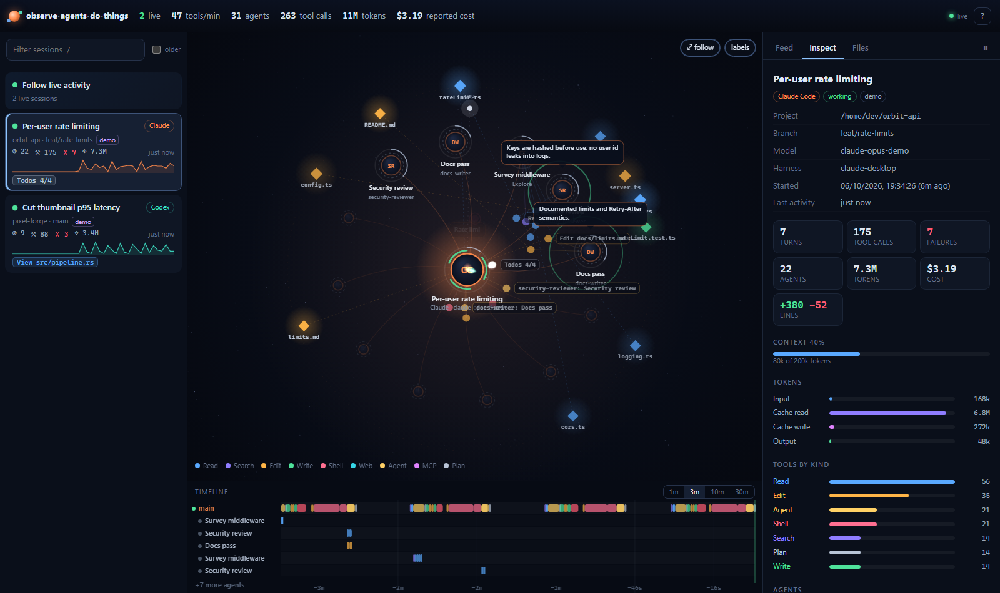
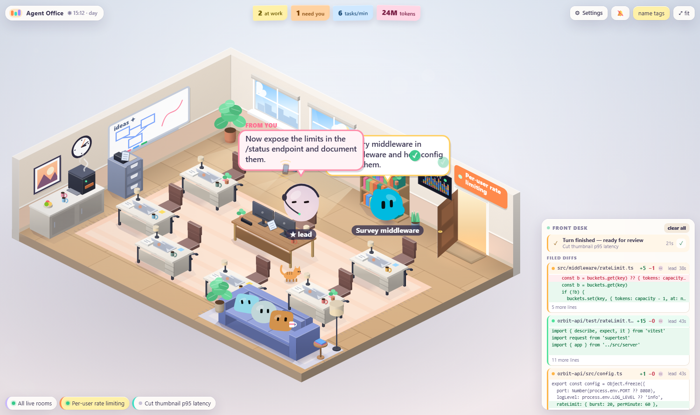
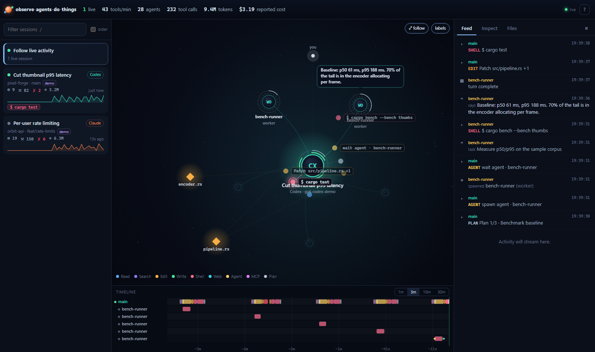
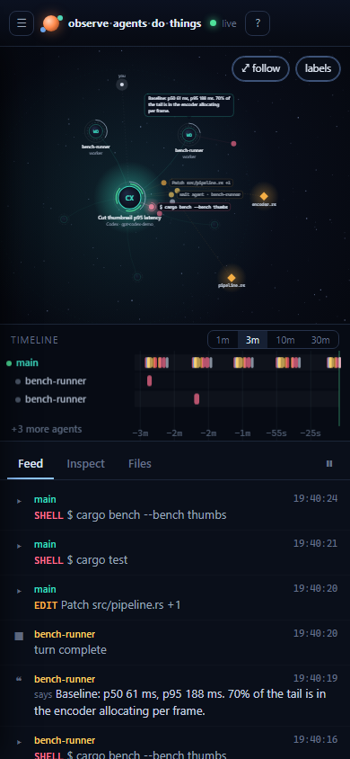
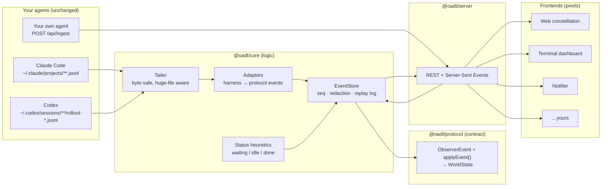

# observe-agents-do-things

**Watch your coding agents work: live, visual, read-only.**

Keep using Claude Code and Codex exactly as you do now: the CLI, the IDE extensions or the desktop apps. `oadt` sits beside them, tails the transcripts they already write, and turns them into one clean live event stream. A visual frontend renders that stream. You can also build your own frontend on top of it in a few lines.



<sub>Demo mode (`oadt --demo`). Everything you see is simulated. No real transcripts are used in this repository.</sub>

---

### …or as a cosy isometric office



Visualizations are plugins over the same data. Switch with the corner button, the `V` key or `?viz=office`. Each one owns its entire view: layout, rendering, input and HUD. The office maps spawns to new hires walking in, permission prompts to raised hands, file work to papers flying to the filing cabinet, and finished turns to confetti. See **[docs/VISUALIZATIONS.md](docs/VISUALIZATIONS.md)**, including how to write your own.

## Why

Agent visualisers tend to *be* the harness, or to install themselves into it. This project does neither:

- **Zero setup in your agents.** No hooks, no settings edits, no wrappers, no API keys. It only reads files.
- **Use whatever app you like.** Claude Code CLI, the VS Code and JetBrains extensions, the Claude desktop app, the Codex CLI and Codex Desktop all write transcripts that `oadt` picks up within a second.
- **Logic and pixels are separate.** All detection, normalisation and state derivation lives in the core. Frontends get a small typed protocol, plus a pure function that folds events into state. The bundled UI is just one consumer, and the [examples](examples/) include a terminal dashboard, a notifier and a 60-line HTML page.

## Features

- **Swappable visualizations.** Each visualization is a plugin that defines its whole view; the core only provides data. Two ship today, *Constellation* and *Agent Office*. Adding one is a single module plus one line to register it.
- **Live constellation view.** Agents are glowing nodes. Subagents branch off the tool call that spawned them. Tool calls fly out as color-coded satellites, and the files each agent touches orbit as heat-mapped tiles. Particles show prompts, results and inter-agent messages as they happen.
- **Subagents in both harnesses.** Claude Code `Agent`/`Task` subagents are linked through their `meta.json` sidecars. Codex `spawn_agent` threads are rebuilt into one tree across separate rollout files.
- **Knows when you're needed.** Sessions move between *working*, *waiting* and *idle*. *Waiting* means a tool has been pending with no transcript activity, which is almost always a permission prompt. *Idle* means the turn ended.
- **Swimlane timeline.** One lane per agent, with tool calls as bars and markers for prompts and turn ends. Hover for detail, click to inspect.
- **Inspector.** Click any session, agent, tool call or file. It shows tool input and output, failures, durations, the agent tree, tokens by type, context-window fill, reported cost, lines changed, PR links and Codex goals.
- **Many sessions at once.** *Follow live activity* lays every running session out side by side, across projects and harnesses.
- **Huge transcripts are fine.** A byte-level, UTF-8-safe tailer reads the head plus a bounded tail, so multi-hundred-MB rollouts load in milliseconds.
- **Replay.** `oadt replay <transcript.jsonl>` replays any recorded session in compressed real time.
- **Bring your own agent.** `POST /api/ingest` accepts protocol events, so your own agent can show up next to Claude and Codex.
- **Private by default.** Binds to loopback and rejects foreign `Host` headers (DNS rebinding) and foreign origins. Requires a token when exposed. Optional `--redact content|strict` modes strip text before anything is served.
- **Tiny.** No runtime dependencies in the core, server or client. The web UI, with both visualizations, is about 45 KB gzipped (JS and CSS), uses vanilla TypeScript and canvas, and makes no external network requests.

<table><tr>
<td width="72%"></td>
<td width="28%"></td>
</tr><tr><td>Codex: <code>spawn_agent</code> threads become a tree; the timeline shows each agent's tool calls.</td><td>Works on a phone too.</td></tr></table>

## Quick start

Requires Node.js 20.11 or newer.

```bash
git clone https://github.com/Dri-water/observe-agents-do-things
cd observe-agents-do-things
npm install
npm run build
npm start            # → http://127.0.0.1:4545
```

Then start (or keep using) Claude Code or Codex anywhere on the machine. Nothing running? Try the simulator:

```bash
npm run demo
```

### Docker

```bash
docker compose up -d --build   # container 'observe-agents-do-things', restarts automatically
```

This mounts `~/.claude` and `~/.codex` read-only, publishes the UI on `127.0.0.1:4545` only, and keeps the last 12 hours of history (`OADT_SINCE`). Inside a container, change detection falls back to polling, because bind mounts don't forward file-change events. Updates still arrive within about a second.

## How it works



1. **Adapters** understand each harness's on-disk format: record types, injected system content, split streaming records, subagent linkage, token accounting and exit codes. They emit a dozen kinds of normalised events.
2. **The store** stamps each event with a sequence number, applies the privacy policy and folds it into a `WorldState` using `applyEvent`. That is a pure function exported by `@oadt/protocol`.
3. **The server** sends a snapshot of that world, then streams every event over SSE. Clients run the *same* `applyEvent`, so every frontend sees identical derived state: agent trees, open tools, file heat and token totals. Reconnecting clients resume from their last sequence number.

## Build your own frontend

The whole contract is in [`@oadt/protocol`](packages/protocol/src/events.ts): 13 event kinds and one reducer.

```ts
import { connect, sessionList, openTools } from '@oadt/client'

const client = connect({ url: 'http://127.0.0.1:4545' })
client.onChange((world) => {
  for (const s of sessionList(world)) {
    console.log(s.status, s.meta.title, openTools(s).map((t) => t.title))
  }
})
```

Using React? `@oadt/react` wraps the same client in hooks:

```tsx
import { ObserverProvider, useSessions, useOpenTools } from '@oadt/react'

function Sessions() {
  const sessions = useSessions({ liveOnly: true })
  return sessions.map((s) => <Session key={s.id} id={s.id} title={s.meta.title} />)
}

function Session({ id, title }: { id: string; title?: string }) {
  const running = useOpenTools(id)
  return <p>{title}: {running.map((t) => t.title).join(', ') || 'idle'}</p>
}

export const App = () => (
  <ObserverProvider url="http://127.0.0.1:4545">
    <Sessions />
  </ObserverProvider>
)
```

No build step? The raw stream is plain SSE:

```js
const es = new EventSource('/api/stream')
es.addEventListener('event', (m) => {
  const e = JSON.parse(m.data)
  if (e.kind === 'tool.started') console.log(e.agentId, e.title)
})
```

Serve any static frontend with `oadt --ui ./my-frontend`. See **[docs/FRONTENDS.md](docs/FRONTENDS.md)** and the [examples](examples/):

| Example | What it shows |
|---|---|
| [`minimal-feed`](examples/minimal-feed/index.html) | One HTML file, no build, no dependencies |
| [`react-dashboard`](examples/react-dashboard/src/App.tsx) | A React app built on `@oadt/react` hooks |
| [`terminal-dashboard`](examples/terminal-dashboard/index.mjs) | A live `top` for agents with `@oadt/client` |
| [`notify`](examples/notify/index.mjs) | A ping when an agent waits for you or finishes its turn; no UI at all |
| [`custom-agent`](examples/custom-agent/index.mjs) | Make your own agent observable via `/api/ingest` |

## CLI

```
oadt [serve]              watch Claude Code + Codex and serve the UI (default)
oadt --demo               simulated sessions, no real data
oadt replay <files…>      replay transcripts as if live (--speed 10 --loop)
oadt tail [--json]        print normalised events in the terminal (NDJSON with --json)
oadt sessions [--json]    list recent sessions and exit

  -p, --port <n>          default 4545
      --host <addr>       default 127.0.0.1; a non-loopback host auto-generates a token
      --token <secret>    require this bearer token
      --no-auth           no token even on a non-loopback host (e.g. a container published on 127.0.0.1)
      --since <dur>       backfill window: 30m, 6h, 2d (default 6h)
      --harness <list>    claude-code,codex
      --redact <mode>     none | content | strict
      --claude-dir <dir>  default $CLAUDE_CONFIG_DIR or ~/.claude
      --codex-home <dir>  default $CODEX_HOME or ~/.codex
      --ui <dir>          serve a different frontend · --no-ui for API only
      --cors <origin>     allow a cross-origin frontend (repeatable)
      --read-only         disable POST /api/ingest
      --open              open the browser
```

`oadt tail --json | jq` turns your agents into a structured log you can pipe anywhere.

## API

| | |
|---|---|
| `GET /api/stream` | SSE: `hello`, then `snapshot` (WorldState), then `event`s. Honours `Last-Event-ID`. `?session=` filters. |
| `GET /api/state` | Full WorldState snapshot |
| `GET /api/sessions` | Session summaries |
| `GET /api/sessions/:id` | One session's full state |
| `GET /api/sessions/:id/events` | That session's event history (`?after=seq`) |
| `GET /api/events?after=` | Global event log, for polling clients |
| `GET /api/info` | Version, sources, privacy mode |
| `POST /api/ingest` | Push your own events (JSON object or array) |

Details in **[docs/API.md](docs/API.md)** and **[docs/PROTOCOL.md](docs/PROTOCOL.md)**.

## What gets detected

| | Claude Code | Codex |
|---|---|---|
| Sessions & titles | ✓ custom titles, first prompt | ✓ `session_index` names, first prompt |
| Subagents | ✓ `subagents/agent-*.jsonl` + `meta.json` → spawning tool call | ✓ `spawn_agent` threads via `session_meta.source.subagent` |
| Tool calls | ✓ all tools, MCP (`mcp__server__tool`) | ✓ `exec` scripts (inner commands summarised), `apply_patch` files, MCP, web search |
| Success / failure | ✓ `is_error`, interrupts | ✓ exit codes, `Script failed`, aborts |
| Turns | ✓ prompt → `end_turn` / interrupt | ✓ `task_started` / `task_complete` / `turn_aborted` |
| Tokens | ✓ per message, de-duplicated across streamed records | ✓ cumulative `token_count` → deltas |
| Context fill | ✓ (window when known) | ✓ with `model_context_window` |
| Extras | cost, lines ±, PR links, permission mode | goals, model per turn |
| Waiting for approval | heuristic (tool pending with no activity) | heuristic |

New harnesses are a single adapter. See **[docs/ADAPTERS.md](docs/ADAPTERS.md)**.

## Privacy & security

Transcripts contain your code and your conversations, so `oadt` is careful with them:

- **Read-only.** It never writes to your agents' directories.
- **Local by default.** It listens on `127.0.0.1`. With `--host 0.0.0.0` it requires a bearer token, generating one if you don't pass `--token`. Only `--no-auth` turns that off, for setups like the Docker container that publish the port on loopback only.
- **No cross-site access.** Requests with foreign `Host` headers are rejected (DNS rebinding), and so are cross-origin requests from origins you haven't allowed with `--cors`. `/api/ingest` requires `application/json`, which forces a CORS preflight.
- **Redaction.** `--redact content` drops prompts, replies, thinking, tool I/O, subagent tasks and goals but keeps the flow. `--redact strict` also drops titles, paths and repository details.
- **No telemetry, no external requests.** The UI uses system fonts and loads nothing from the internet.

## Packages

| Package | Role | Runtime deps |
|---|---|---|
| [`@oadt/protocol`](packages/protocol) | Event types, `applyEvent` projection, selectors | none |
| [`@oadt/core`](packages/core) | Tailer, adapters, store, status heuristics, demo and replay sources | protocol |
| [`@oadt/server`](packages/server) | HTTP + SSE API, the `oadt` CLI | core, protocol |
| [`@oadt/client`](packages/client) | Browser/Node live client with resume | protocol |
| [`@oadt/react`](packages/react) | React provider and hooks (`useSessions`, `useSession`, `useAgentTree`, `useOpenTools`, `useEvents`…) | client, react (peer) |
| [`apps/web`](apps/web) | The bundled web app: a host plus the Constellation and Agent Office visualizations | client |

## Development

```bash
npm run dev            # API in demo mode + Vite with hot reload on :5175
npm run dev -- --real  # same, against your real transcripts
npm test               # unit + end-to-end tests (node:test)
```

## Credits

This project was inspired by [agent-flow](https://github.com/patoles/agent-flow) by Simon Patole (Apache-2.0), a VS Code extension that visualises Claude Code orchestration. Reading its source taught me several hard edge cases, including inline `progress` records, redacted thinking blocks, injected-prompt prefixes and timer-based permission detection. `observe-agents-do-things` is an independent implementation with a different goal: a standalone, harness-agnostic observer service that exposes a protocol any frontend can consume. No code was copied.

## License

[MIT](LICENSE)
