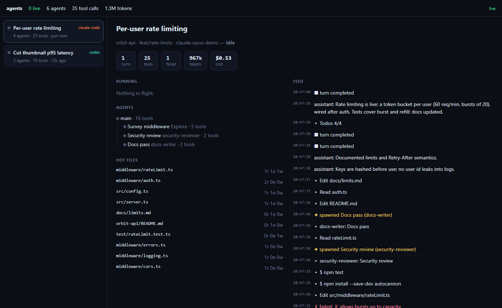

# Building a frontend

The bundled constellation UI is just one consumer. Any frontend gets the same
data, and the core does the hard parts:

- parsing each harness's format
- linking subagents to the calls that spawned them
- de-duplicating streamed records
- deciding when an agent is waiting
- summarising tool calls into titles and categories

There are four ways to plug in, from least to most structured.

## 1. Raw SSE (no dependencies)

```html
<script>
  const es = new EventSource('/api/stream')
  es.addEventListener('snapshot', (m) => render(JSON.parse(m.data)))
  es.addEventListener('event', (m) => onEvent(JSON.parse(m.data)))
</script>
```

Serve it with `oadt --ui ./my-frontend`. [`examples/minimal-feed`](../examples/minimal-feed/index.html)
is a complete 60-line version.

## 2. `@oadt/client` (recommended)

A live mirror of the server's world that works in browsers and in Node:

```ts
import { connect, sessionList, agentTree, openTools, formatCount, totalTokens } from '@oadt/client'

const client = connect({ url: 'http://127.0.0.1:4545', token: process.env.OADT_TOKEN })

client.on('status', (s) => console.log('connection:', s))      // connecting | live | reconnecting | closed
client.on('event', (e, world) => { /* one event at a time */ })
client.onChange((world, events) => {                             // batched per microtask: draw here
  for (const s of sessionList(world)) {
    console.log(s.status, s.meta.title, formatCount(totalTokens(s.usage)))
    console.log(agentTree(s))                                    // nested agents
    console.log(openTools(s))                                    // what is running right now
  }
})

const history = await client.sessionEvents(sessionId)          // backfill a feed
```

Behaviour:

- **Resume.** The client reconnects with backoff and resumes from the last
  sequence number, so no events are lost or duplicated.
- **Same projection.** It applies events with the same `applyEvent` the
  server uses, so `client.world` always equals the server's world.
- **Draw in `onChange`.** It coalesces bursts, such as a backfill, into one call.

## 3. React: `@oadt/react`

A provider plus hooks over the same client. Every hook re-renders when the world changes, at most once per `throttleMs` (default 100 ms).

```tsx
import { ObserverProvider, useSessions, useSession, useAgentTree, useOpenTools, useEvents, useNow } from '@oadt/react'

<ObserverProvider url="http://127.0.0.1:4545" token={token} throttleMs={100}>
  <App />
</ObserverProvider>
```

| Hook | Returns |
|---|---|
| `useSessions({ liveOnly? })` | Sessions ordered waiting → working → recent |
| `useSession(id)` | One `SessionState` |
| `useAgentTree(id)` | Nested agents of a session |
| `useOpenTools(id?)` | Tool calls in flight (one session or all) |
| `useHotFiles(id, limit?)` | Most-touched files |
| `useTotals()` | Live/waiting counts, agents, tools, tokens, cost |
| `useEvents({ session?, limit?, filter?, backfill? })` | Rolling event list, optionally pre-filled with the session's history |
| `useConnectionStatus()` | `connecting` / `live` / `reconnecting` / `closed` |
| `useObserver(selector)` | Anything you derive from the world |
| `useNow(ms)` | A ticking clock for "3s ago" labels |

The world is updated in place, so read state through hooks in the component that renders it, and pass ids, not state objects, into `React.memo` components. [`examples/react-dashboard`](../examples/react-dashboard/src/App.tsx) is a complete app. Run it with `npm run dev --workspace examples/react-dashboard`, or build it and serve it with `oadt --ui examples/react-dashboard/dist`.



## 4. Embed the core

Skip HTTP entirely, for example in an Electron app, a VS Code extension or a
CLI tool:

```ts
import { Observer, sessionList } from '@oadt/core'

const obs = new Observer({ sinceMs: 3 * 3600_000, redact: 'none' })
obs.subscribe((event) => { /* live */ })
await obs.start()                 // resolves after the backfill
console.log(sessionList(obs.world))
```

## Tips

- **Status colours.** `working`, `waiting`, `idle` and `done` are deliberately few.
  `waiting` is the one users care about most, because the agent is blocked on them.
- **Order.** Events are not strictly time-ordered. Use `ts` for placing
  things on a timeline and `seq` for "what's new since".
- **Volume.** A busy session can produce hundreds of events a minute. Redraw on
  `onChange` and throttle DOM work. The bundled UI redraws canvas every frame
  and panels every ~400 ms.
- **Privacy.** Respect `hello.redact`. If it is `content`, message texts are
  placeholders such as `[123 chars]`.
- **Debugging.** In the bundled UI, `window.__oadt` exposes the live client,
  scene and camera.
