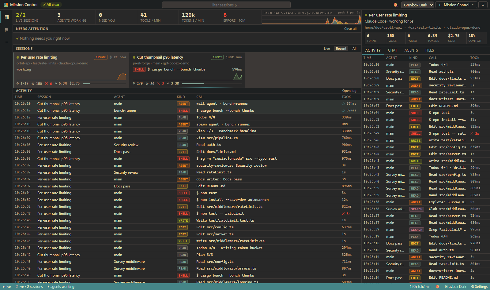
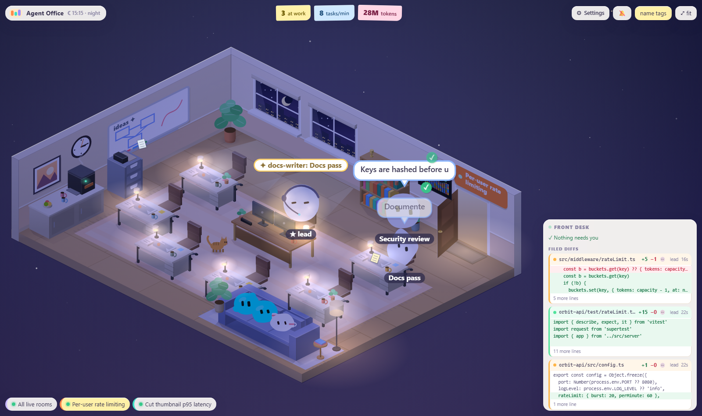

# Visualizations

The web app is a thin **host**. It connects to the observer once and mounts
one **visualization** at a time. A visualization is not a theme or a skin. It
owns everything inside its element:

- its DOM and layout (sidebars, HUDs, panels, or none at all)
- its rendering technology (canvas 2D, SVG, WebGL, a framework, plain HTML)
- its own input handling, camera, animation loop and styles
- its own *interpretation* of the data (stars and orbits, an office building, a table…)

What it does **not** do is parse transcripts, derive agent status or link
subagents. That all happens in the core, and the visualization reads it from
the live `WorldState` and the event stream.

Switch visualizations from the switcher, with the `V` key, with `?viz=<id>` in
the URL, or on the settings page (`⚙`, or `Ctrl+,`). The settings page also
holds the theme, notification preferences and each visualization's own options.

## Built in

| | |
|---|---|
| **Constellation** (`constellation`) | Agents as glowing nodes with subagents in a radial tree, tool calls as satellites, files in orbit. Swimlane timeline, live feed and an inspector for every session, agent, tool and file. |
| **Mission Control** (`mission`) | A compact IDE-style dashboard: what needs you, what is running, and how fast. Themeable. See below. |
| **Agent Office** (`office`) | A cute isometric office. Each session is a room and each agent a little worker. See below. |

### Mission Control



Built for daily use on a second monitor:

- **Needs attention.** Approvals waiting (with a live timer), finished turns ready for review, failure streaks, context almost full, and tools that have run unusually long. Acknowledge items one by one, or clear them all with `X`.
- **Notifications.** Off by default. Turn on desktop notifications, a chime and the tab-title count on the settings page, and choose which kinds alert you. They work in every visualization, not just this one.
- **Live overview.** KPIs (live sessions, working agents, tools/min, tokens/min, recent errors), a stacked throughput chart by tool kind, and compact session tiles. Each tile shows what the session is doing right now with a ticking timer, plus a sparkline and a context gauge.
- **Detail panel.** Per-session Activity (every tool call; click one for its input and output), Chat (prompts and replies), Agents (the tree, each agent's current tool and how long it has been waiting) and Files.
- **Themes.** Dark Modern, Light Modern, Gruvbox Dark and Gruvbox Light, or follow the system.

Keys: `/` filter, `J`/`K` move between sessions, `1`–`4` detail tabs, `X` acknowledge all.

### Agent Office


How the data maps onto the office:

| What happens | What you see |
|---|---|
| A session | A room with the team's colour on the rug and the session title on a plaque by the door |
| The main agent | The team lead in a headset at the big two-monitor desk |
| A subagent is spawned | The phone rings at the parent's desk, the door swings open and a new hire walks in to a free desk |
| A subagent finishes | It takes a coffee break on the couch, then heads home through the door |
| A tool call | The worker types, its screen glows in the tool's colour and a chip shows what it's doing |
| Reading or editing files | Papers fly between the desk and the filing cabinet |
| A tool fails | A puff of smoke and a red ✗ |
| Thinking | A thought cloud with bubbling dots |
| Waiting on you (permission prompt) | The worker raises a hand, a "!" bubble bounces and an amber ring pulses on the floor |
| Your prompt | A paper airplane flies in through the window to the lead, and the note pops up "FROM YOU" |
| An assistant message | A speech bubble |
| A plan / todo update | The whiteboard shows checkboxes and the current step |
| A finished turn | Confetti and a little jump |
| Long idle | Zzz |

There are also real details: the wall clock shows your time, the windows follow
day and night (click the clock to force day or night, or use `?time=day`),
lamps glow at night, the coffee machine steams, and there's an office cat.

Click any worker for their profile card (role, model, current task, tools,
tokens, recent work). Drag to pan and scroll to zoom. `F` fits the view, `L`
toggles name tags and `A` follows all live rooms.



## Writing your own

Implement the `Visualization` interface from
[`apps/web/src/viz/types.ts`](../apps/web/src/viz/types.ts) and add it to
[`apps/web/src/viz/index.ts`](../apps/web/src/viz/index.ts):

```ts
import type { Visualization } from '../types'
import { Disposer } from '../types'
import { sessionList } from '@oadt/protocol'

export const ticker: Visualization = {
  id: 'ticker',
  name: 'Ticker',
  description: 'One line per session, like a stock ticker.',
  mount(root, { client, switcher }) {
    const d = new Disposer()
    root.innerHTML = '<div class="ticker"><header></header><ul></ul></div>'
    root.querySelector('header')!.append(switcher) // or leave it out and the host floats it
    const list = root.querySelector('ul')!
    d.add(client.onChange((world) => {
      list.replaceChildren(...sessionList(world).map((s) => {
        const li = document.createElement('li')
        li.textContent = `${s.status.toUpperCase()} ${s.meta.title ?? s.id} — ${s.counts.tools} tools`
        return li
      }))
    }))
    return { destroy: () => d.dispose() }
  },
}
```

The rules:

1. **Everything you need is on `ctx`.** `ctx.client` is the live data,
   `ctx.settings` stores your options (declare them in `settings` on the
   visualization and they appear on the settings page), `ctx.theme()` and
   `ctx.onTheme()` give the app theme, and `ctx.attention` shares what needs the
   user, including acknowledgements. On the client, `client.world` is the live
   `WorldState`. `client.onChange((world, events) => …)` fires at most once
   per microtask with the new events. `client.sessionEvents(id)` gives history.
   The selectors in `@oadt/protocol` (`sessionList`, `agentTree`, `openTools`,
   `hotFiles`…) cover most derived views.
2. **Clean up in `destroy()`.** `Disposer` helps: `d.add(unsubscribe)`,
   `d.listen(window, 'keydown', fn)` and `d.loop(frame)` for a
   requestAnimationFrame loop that stops on dispose. The host removes your
   element afterwards.
3. **Don't assume you mounted first.** The client may already be live with a
   full world when you mount, so render from `client.world` straight away.
4. **Keep styles scoped.** Every visualization's CSS ends up in the same
   bundle. Prefix your classes (the office uses `of-`).
5. **If two visualizations need the same derived data, put it in the core.**
   That keeps them honest and lets frontends outside the web app, like the
   terminal dashboard and React hooks, have it too.

Outside the web app you can build a frontend with anything. See
[FRONTENDS.md](FRONTENDS.md) for raw SSE, the client SDK, the React hooks and
embedding the core directly.
